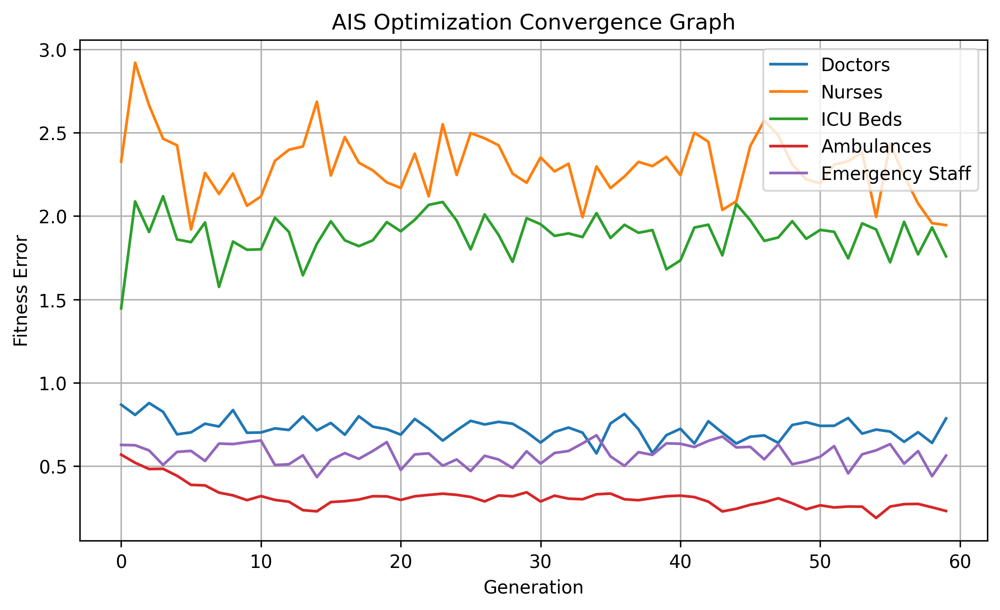

# 🏥 AIS-Based Smart Healthcare Resource Allocation and Hospital Capacity Optimization System

> **Artificial Immune System (AIS) Optimized Machine Learning for Intelligent Hospital Resource Allocation**



---

# 📌 Project Overview

The **AIS-Based Smart Healthcare Resource Allocation and Hospital Capacity Optimization System** is an Artificial Intelligence and Bio-inspired Optimization project developed to improve the allocation of healthcare resources among Indian Government Headquarters Hospitals.

The system uses hospital bed strength information to estimate healthcare requirements including:

- Doctors
- Nurses
- ICU Beds
- Ambulances
- Emergency Staff

Unlike conventional prediction systems, this project integrates the **Artificial Immune System (AIS)** optimization algorithm with Machine Learning models to intelligently optimize hospital resource allocation while minimizing allocation errors.

---

# 🎯 Objectives

- Analyze hospital bed capacity
- Classify hospitals based on infrastructure size
- Predict healthcare resource requirements
- Optimize resource allocation using Artificial Immune System (AIS)
- Compare Machine Learning models
- Visualize optimization convergence
- Generate deployable AI models

---

# 📂 Dataset

**Dataset Name**

```
indian_medicine_head_quarters_hospitals_and_bed_strength_2019.csv
```

Dataset contains:

- Headquarters Hospital Name
- Sanctioned Bed Strength
- Hospital Identification

---

# ⚙️ Feature Engineering

The following healthcare parameters are automatically generated.

| Feature | Formula |
|----------|----------|
| Doctors Required | Beds ÷ 20 |
| Nurses Required | Beds ÷ 5 |
| ICU Beds Required | 15% of Beds |
| Ambulances Required | Beds ÷ 100 |
| Emergency Staff Required | Beds ÷ 25 |
| Equipment Score | Sum of all required resources |

Hospitals are categorized into:

- Small
- Medium
- Large
- Very Large

---

# 🧠 Artificial Immune System (AIS)

The Artificial Immune System is inspired by the biological immune system.

The algorithm follows these steps:

1. Initialize antibodies (candidate solutions)
2. Evaluate affinity (fitness)
3. Select best antibodies
4. Clone high-affinity antibodies
5. Perform hypermutation
6. Replace weak antibodies
7. Obtain optimized resource allocation

The convergence of the optimization process is shown below.


---

# 🤖 Machine Learning Models

## 1. Artificial Neural Network (ANN)

Used for hospital capacity classification.

Architecture

```
Input Layer
      │
      ▼
Dense (64)
      │
      ▼
Dropout
      │
      ▼
Dense (32)
      │
      ▼
Softmax Output Layer
```

---

## 2. Random Forest Classifier

Used for:

- Hospital Capacity Classification

---

## 3. Decision Tree Classifier

Used for:

- Model Comparison

---


## 4. Random Forest Regressor

Used for predicting:

- Doctors Required
- Nurses Required
- ICU Beds Required
- Ambulances Required
- Emergency Staff Required

---

# 🧬 AIS Optimization

The Artificial Immune System optimizes:

- Doctors Allocation
- Nurses Allocation
- ICU Allocation
- Ambulance Allocation
- Emergency Staff Allocation

Optimized columns generated:

```
AIS_Optimized_Doctors

AIS_Optimized_Nurses

AIS_Optimized_ICU_Beds

AIS_Optimized_Ambulances

AIS_Optimized_Emergency_Staff
```

---

# 📈 Evaluation Metrics

## Classification

- Accuracy
- Precision
- Recall
- F1 Score
- Confusion Matrix

## Regression

- Mean Absolute Error (MAE)
- Root Mean Squared Error (RMSE)
- R² Score

## Optimization

- Fitness Error
- Convergence Curve

---

# 📊 Generated Graphs

The project automatically generates:

```
ais_accuracy_graph.png

ais_heatmap.png

ais_comparison_graph.png

ais_result_graph.png

ais_prediction_graph.png

ais_resource_allocation_graph.png

ais_convergence_graph.png
```

---

# 📁 Generated Files

## Models

```
ais_hospital_capacity_ann_model.h5

ais_hospital_capacity_ann_model.json

ais_hospital_capacity_ann_model.yaml

ais_hospital_capacity_models.pkl
```

---

## CSV Files

```
ais_processed_data.csv

ais_hospital_capacity_prediction.csv

ais_hospital_capacity_result.csv

ais_classification_report.csv

ais_optimization_result.csv
```

---

## Images

```
ais_accuracy_graph.png

ais_heatmap.png

ais_comparison_graph.png

ais_result_graph.png

ais_prediction_graph.png

ais_resource_allocation_graph.png

ais_convergence_graph.png
```

---

# 📂 Project Structure

```text
Hospital Capacity Optimization System
│
├── indian_medicine_head_quarters_hospitals_and_bed_strength_2019.csv
│
├── ais_hospital_capacity_ann_model.h5
├── ais_hospital_capacity_ann_model.json
├── ais_hospital_capacity_ann_model.yaml
├── ais_hospital_capacity_models.pkl
│
├── ais_processed_data.csv
├── ais_hospital_capacity_prediction.csv
├── ais_hospital_capacity_result.csv
├── ais_classification_report.csv
├── ais_optimization_result.csv
│
├── ais_accuracy_graph.png
├── ais_heatmap.png
├── ais_comparison_graph.png
├── ais_result_graph.png
├── ais_prediction_graph.png
├── ais_resource_allocation_graph.png
├── ais_convergence_graph.png
│
└── README.md
```

---

# 💻 Technologies Used

- Python
- TensorFlow / Keras
- Scikit-learn
- NumPy
- Pandas
- Matplotlib
- Artificial Immune System (AIS)

---

# 🚀 Workflow

```text
Dataset
   │
   ▼
Data Preprocessing
   │
   ▼
Feature Engineering
   │
   ▼
Hospital Categorization
   │
   ▼
Artificial Immune System Optimization
   │
   ▼
Machine Learning Models
   │
   ▼
Prediction
   │
   ▼
Evaluation
   │
   ▼
Visualization
   │
   ▼
Save Models & Results
```

---

# ✨ Key Features

- ✅ Automatic Feature Engineering
- ✅ Hospital Capacity Classification
- ✅ Healthcare Resource Prediction
- ✅ Artificial Immune System Optimization
- ✅ Intelligent Resource Allocation
- ✅ ANN Classification
- ✅ Random Forest Regression
- ✅ Decision Tree Comparison
- ✅ Automatic Graph Generation
- ✅ CSV Report Generation
- ✅ Export Models as:
  - H5
  - PKL
  - JSON
  - YAML

---

# 🌍 Applications

- Government Hospital Planning
- Healthcare Infrastructure Development
- Smart City Healthcare Systems
- Medical Resource Distribution
- Hospital Capacity Optimization
- Emergency Preparedness
- Public Health Decision Support
- AI-based Healthcare Analytics

---

# 🔮 Future Scope

- Real-time Hospital Occupancy Prediction
- GIS-based Hospital Mapping
- Disease Outbreak Forecasting
- IoT-enabled Bed Monitoring
- Deep Learning-based Resource Forecasting
- Multi-objective Optimization
- Cloud-based Hospital Dashboard
- Integration with National Health Systems

---

# 📌 Conclusion

This project demonstrates how **Artificial Immune System (AIS)** optimization can significantly improve traditional machine learning techniques for healthcare resource planning.

By combining intelligent optimization with predictive analytics, the system provides accurate recommendations for allocating doctors, nurses, ICU beds, ambulances, and emergency staff based on hospital capacity.

The generated models, optimization reports, visualizations, and deployment-ready artifacts make this project suitable for:

- Academic Research
- Government Healthcare Planning
- Smart Hospital Management
- Healthcare Decision Support Systems

---

# 👨‍💻 Author

**Sagnik Patra**

**M.Tech – Computer Science & Engineering**

Artificial Intelligence • Machine Learning • Bio-inspired Optimization • Healthcare Analytics
